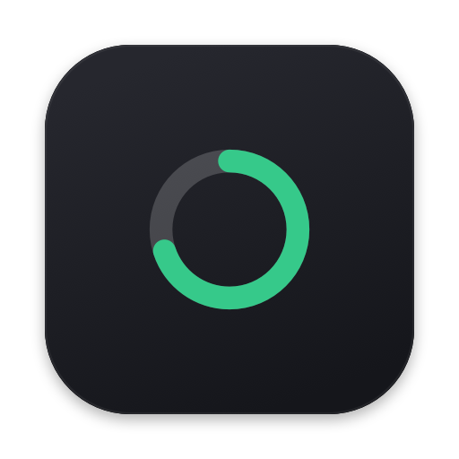

# Token Tab

<p align="center">
  <br>
  <picture>
    <source media="(prefers-color-scheme: dark)" srcset="app/Branding/gauge-wordmark-dark.png">
    
  </picture>
</p>

[](https://github.com/YiftachCohen/token-tab/actions/workflows/ci.yml)

Token Tab shows your Claude Code token usage in the macOS menu bar, with your current
5-hour rate-limit window (exact reset countdown) a click away in the dropdown. It reads
the session logs Claude Code already writes on disk, so it needs no API keys, no
keychain access, and no AWS credentials, and it makes no network calls.

It reads only the usage numbers. Your prompts and code never leave your machine,
because the app has no way to send them anywhere.

> Status: early. The CLI + SwiftBar plugin work today and reconcile with `ccusage` to
> within 0.003%. The native sandboxed menu-bar app is the roadmap (see below).

## What it does

- Reads `~/.claude/projects/**/*.jsonl` (the transcripts Claude Code already writes).
- Counts tokens per model, per surface (subscription / Bedrock), and per time window
  (today / this week / last 5h).
- Estimates **dollars** from a bundled per-model price table (today / this week / all
  time, broken down by model). A local estimate, not an invoice — see "Cost" below.
- Works the same whether Claude Code talks to the Anthropic API, a subscription
  (Max/Pro), or **AWS Bedrock**. The token counts are in the local logs either way,
  so no AWS credentials are needed to read them.

## What runs where

One idea — *read the logs, aggregate, show usage* — implemented as **two engines** (a
pure JS one and a Swift port, kept in parity) behind **three front-ends**. Only one piece
ever touches the network, and only because you start it:

| Piece | What it is | You run it via | Network? |
|---|---|---|---|
| `src/` **JS engine** | parse + dedup + aggregate (`core.mjs`, `token-tab.mjs`, `pricing.mjs`) | the two front-ends below | no |
| **CLI** | `node src/token-tab.mjs` → a terminal report | Terminal | no |
| **SwiftBar** | shell wrappers run the JS engine every 30s/2m | the SwiftBar app | no¹ |
| **Native app** | `app/Token Tab.app`, the menu-bar UI (Swift port in `app/Sources/TokenTabCore`) | you launch it; **App-Sandboxed** | **no — kernel-enforced** |
| **Live sidecar** | `adapters/write-live.mjs` runs `claude /usage`, writes a cache file | **you** (Terminal, or the LaunchAgent) | **yes — via `claude`** |
| `claude` CLI | the only thing that knows the real server-side `%` | spawned by the sidecar / SwiftBar-live | yes |

¹ the `…-live.2m.sh` variant calls `claude`. The default `…30s.sh` does not.

**The rule that makes it click:** the **native app never touches the network** — it can't,
the sandbox forbids it. The live `%` reaches it only because the **sidecar you scheduled**
writes a small cache file (`<logDir>/.token-tab-live.json`) that the app then *reads*. See
"The live server %" → "Turn on live" below.

## The trust model (the whole point)

Honest claims, each verifiable:

- **It cannot phone home.** No network code, no dependencies. (The native app will make
  this OS-enforced via App Sandbox with no network entitlement.)
- **It never reads your content.** The parser decodes only the metadata it needs:
  `type`, `model`, `message.id`, `requestId`, `usage`, `timestamp`, `isSidechain`. It
  never touches `message.content` (your prompts, code, and responses).
- **It keeps nothing.** No cache, no telemetry, no files written.

What it cannot promise: to be *blind* to sensitive data. Any usage meter must read the
logs, and those logs contain your prompts and code. The guarantee is narrower and
stronger: it reads the numbers, sends nothing, stores nothing.

### The two-minute audit

This is a single dependency-free script. Verify it yourself:

```sh
# 1. No dependencies to vet:
cat package.json | grep -A1 dependencies          # -> {}

# 2. No network, ever (prints nothing):
grep -RnE "fetch|http|https|net\.|URLSession|Socket|dns" src/

# 2b. No subprocess in the audited core (prints nothing). The opt-in live
#     adapter is fenced under adapters/, NOT in src/, so the core stays a clean
#     sweep even with live enabled:
grep -RnE "child_process|spawn|execFile" src/

# 3. It never reads content. The only `.content` mention is a comment, not code
#    (prints nothing):
grep -RnE "\.content" src/ | grep -v "//"

# 4. Confirm the parser reads only metadata: see `recordFromLine` in src/core.mjs
#    It returns message.id, model, usage, timestamp, isSidechain. Never content.

# 5. Read the whole thing. The audited core (core.mjs + token-tab.mjs +
#    live-parse.mjs + pricing.mjs) is pure parsing, pricing math, and rendering.
#    pricing.mjs is a static rate table + arithmetic — no network, no I/O. The ONLY
#    subprocess in the repo is adapters/claude-live.mjs (the opt-in live path):
grep -RnE "child_process|spawn|execFile" adapters/   # -> only adapters/claude-live.mjs
```

(When the native `.app` ships, the audit adds `codesign -d --entitlements :- TokenTab.app`
to show no network/keychain entitlement, plus `nettop -p <pid>` showing zero connections.)

## Quick start

### CLI
```sh
node src/token-tab.mjs            # human report
node src/token-tab.mjs --json     # machine-readable
node src/token-tab.mjs --swiftbar # SwiftBar format
```

### Menu bar (SwiftBar)
See [`swiftbar/README.md`](swiftbar/README.md). One symlink and you have `◧ <tokens>`
in the menu bar in about a minute. Note: the SwiftBar path may need Full Disk Access (a
broader grant than the native app will ask for); it's the fast on-ramp, not the keeper.

## Accuracy

Validated against [`ccusage`](https://github.com/ryoppippi/ccusage) on real logs:
**99.997% match** on Claude usage. Two things to know:

- `ccusage` now also counts **Codex** (`gpt-5.5`); Token Tab is Claude-only, so compare
  Claude-only subtotals.
- Streaming emits several usage lines per message that share an id; `output_tokens`
  grows across them, so the parser keeps the **last** (final, complete) line. This is
  the one dedup rule that affects the total, and it's pinned by a test.

## Cost (dollars)

The report and dropdown show a dollar **estimate** alongside the token counts: today,
this week, all time, and a per-model breakdown. It's computed locally and on by default
(no network, no key — it's just arithmetic on a bundled rate table). Honest scope:

- **It's an estimate, not your bill.** Good enough to know your tab; not reconciled
  accounting. Bedrock region surcharges and cache-TTL nuances aren't modeled.
- **The price table is `src/pricing.mjs`** — Anthropic's published USD-per-million list
  rates, right there to audit and edit. The two cache classes are derived from the input
  rate by Anthropic's published multipliers: cache **write** = 1.25× input (the 5-minute
  rate; logs don't record the TTL), cache **read** = 0.10× input. All four token classes
  are priced separately — cache-read dominates volume but is the cheapest class.
- **`[1m]` and Bedrock ids** normalize to their base model: the 1M-context tier is
  standard-priced on current models (no long-context premium), and `us.anthropic.<id>`
  reuses the same list rate.
- **Unknown model ⇒ tokens tracked, price not invented.** A model with no entry in the
  table still counts toward every token total; it just lands in an `unpriced` line
  (requests / tokens / model ids) instead of getting a guessed dollar figure. A wrong
  number is worse than an honest "no rate for this."

Validated against `ccusage` on real logs: **token counts reconcile** (per-model within
~0.03%). The **dollar totals differ by design** — `ccusage` prices off LiteLLM's
community table, Token Tab off Anthropic's list rates — so compare Claude-only subtotals
and expect the dollars to diverge (notably on cache-heavy, Opus-tier usage). Token Tab's
rates are visible and editable in one short file; that's the trade.

## Configuration

- `TOKENTAB_LOG_DIR`: point at a non-default log directory.
- `CLAUDE_CONFIG_DIR`: respected (reads `$CLAUDE_CONFIG_DIR/projects`).
- `TOKENTAB_WINDOW_CAP`: your plan's 5h token cap, to show a window `%`. If unset, only
  the exact reset countdown shows (no guessed `%`). Derive it from Claude's `/usage`
  (see below). The native app also lets you set this in the dropdown (stored in
  UserDefaults) or learns it automatically from a live reading — see "live server %".
- `TOKENTAB_LIVE_CACHE`: where the live sidecar (`adapters/write-live.mjs`) writes its JSON
  and the native app reads it. Defaults to `<logDir>/.token-tab-live.json`.
- `TOKENTAB_LIVE`: opt in to the authoritative live server `%` via `claude -p "/usage"`
  (`1`/`true`/`yes`/`on`; canonical `=1`). Off by default. See "The live server %" below.
- `TOKENTAB_CLAUDE_BIN`: absolute path to the `claude` binary, when it isn't auto-resolved
  (SwiftBar's minimal PATH usually needs this).
- `TOKENTAB_LIVE_DEBUG`: when set, prints the reason live data was unavailable to stderr
  (diagnostic only; never stored).
- `CLAUDE_CODE_USE_BEDROCK`: Claude Code's own Bedrock flag — when truthy
  (`1`/`true`/`yes`/`on`), the app shows the **Bedrock / pay-per-token** panel instead of
  the subscription runway. On Bedrock, Claude Code logs bare `claude-*` model ids that are
  indistinguishable from a subscription, so the mode can't be inferred from the logs; this
  flag (the same one that put Claude Code on Bedrock) is the signal. If it's already exported
  in your shell, the native app — sandboxed and launched from Finder — won't see it, so drop
  it in the env file below too.
- Set any of these as env vars, **or** in a local `KEY=VALUE` file kept out of the repo:
  `~/.config/token-tab/env` (or `~/.token-tab.env`). Only `TOKENTAB_*` keys (plus
  `CLAUDE_CODE_USE_BEDROCK`) are read; real env vars take precedence. This is where your cap
  lives so it never gets committed.
- Default log dir: `~/.claude/projects`.

## The usage window (subscription)

The menu-bar headline is your token count (today). On a Claude subscription, the
dropdown also shows your **current 5-hour rate-limit window**, computed entirely from
local logs. Anthropic resets usage in fixed 5-hour blocks anchored to your first message
of the block.

- **The reset countdown is exact** ("Resets in 3h36m"). Verified against Claude's own
  `/usage`: the window starts at your first message (not the top of the hour) and resets
  5 hours later.
- **A `%` shows only when you set `TOKENTAB_WINDOW_CAP`.** Anthropic doesn't publish the
  per-plan cap, and Token Tab will not invent one: a guessed `%` that disagrees with
  Claude is worse than none. To get an accurate `%`, open Claude's `/usage`, note "N%
  used", and set the cap to `current-window-tokens / (N/100)`. For example, 20M at 5% ⇒
  `TOKENTAB_WINDOW_CAP=400000000`.

## The live server % (opt-in)

The **live** server-`%` (what Claude's `/usage` and CodexBar show) is available as an
**opt-in** with `TOKENTAB_LIVE=1`. It does **not** make Token Tab phone home: it shells
out to the official `claude` CLI (`claude -p "/usage"`), which does the keychain read and
the network call, and Token Tab only parses the printed summary (zero token cost,
`num_turns: 0`). The spawn lives in `adapters/claude-live.mjs`, **outside** the audited
`src/` core, so the two-minute audit of `src/` still finds no network and no subprocess
(`grep -RnE "child_process|spawn|execFile" src/` prints nothing) even with live enabled.

- The trust boundary shifts honestly: Token Tab still opens no socket and reads no
  keychain itself; it delegates to the `claude` CLI you already run and trust. That is a
  weaker claim than the default build's "cannot phone home," which is exactly why it is
  off by default and isolated to one fenced file.
- **Fails closed.** If `claude` can't be resolved, times out, or the output format
  changes, it silently falls back to the local estimate and shows a gray
  `live unavailable` line (set `TOKENTAB_LIVE_DEBUG=1` for the reason).
- **Native app: via a sidecar cache (enforcement intact).** The App-Sandboxed menu-bar app
  *cannot* spawn `claude` (no network entitlement — kernel-enforced), so it never reads live
  itself. Instead the opt-in writer `adapters/write-live.mjs` runs the `/usage` call in a
  separate, user-launched process and writes the parsed `%` to `<logDir>/.token-tab-live.json`;
  the sandboxed app reads that file as plain data (it's inside the folder you already granted,
  and both log walkers ignore it — hidden + not `*.jsonl`). The "cannot phone home" guarantee
  stays fully enforced; the network lives entirely in the sidecar you scheduled.

  **Turn on live** (the blessed one-command path):

      adapters/install-live.sh                # loads a LaunchAgent, refreshes every 5 min
      adapters/install-live.sh uninstall      # stop + remove it
      node adapters/write-live.mjs            # or just a one-off, no scheduler

  The app shows the live status in its footer ("Live · 2m ago" / "off") and, when off,
  surfaces these exact commands with a copy button — it can't run them for you (sandbox),
  so it hands them to you.

  When a fresh reading is present the app headlines `91% left · live` and **learns your cap**
  from it (cap ≈ window tokens ÷ session `%`), persisting it so a real `%` keeps showing after
  the reading goes stale — no cap to look up by hand. Past a 10-minute freshness window the
  `· live` tag drops and it falls back to that calibrated cap.
- **On the menu bar:** install `swiftbar/token-tab-live.2m.sh` (refreshes every 2 minutes,
  sets `TOKENTAB_LIVE=1`, resolves `claude`). The default `token-tab.30s.sh` is unchanged
  and never spawns anything — `/usage` should not be polled every 30s.

The **local** 5-hour window (above) stays the default everywhere and needs no opt-in.

## Limitations / roadmap

- **Dollars shipped** as a local estimate (see "Cost" above). Refinements still open:
  per-region Bedrock rates and a 1-hour cache-write tier.
- **Claude-only** today. A Codex surface (`~/.codex`) is a natural add.
- **Native app** is the keeper: SwiftUI `MenuBarExtra`, App Sandbox, no network
  entitlement, scoped read of `~/.claude/projects`, signed + notarized. The full design
  and review live in the project design doc.

## Branding

The mark is the **gauge** — the usage meter itself. It's a progress ring that doubles as
the app's own live indicator: the green arc *is* the runway. It reads from a 16px menu-bar
glyph up to the app icon, and tints cleanly as a monochrome template.

| Role | Hex | |
|---|---|---|
| Gauge green (progress / health) | `#36C98A` | the one signal worth spending color on |
| Wordmark green | `#2E9E63` | the ring on a light background |
| Tile gradient | `#26272E` → `#15161B` | the dark squircle (160°) |
| Ring track | `#D8D5CF` | the unfilled arc |
| Ink | `#1C1D22` | the wordmark text |

**Assets** live in [`app/Branding/`](app/Branding). The SVGs are the source of truth; the
rasters are generated from them.

- **Vector** — `gauge-appicon.svg` (app icon), `favicon.svg` (full-bleed, for browser
  tabs), `gauge-glyph.svg` (monochrome menu-bar glyph, uses `currentColor`),
  `gauge-wordmark.svg` (ring + name lockup).
- **Raster** — `gauge-appicon.png` (hero), `gauge-wordmark{,-dark}.png` (light/dark ink),
  `favicon.ico` (16/32/48), `favicon-{16,32,48,192,512}.png`, `apple-touch-icon.png` (180).

**Use the favicon** on a web page:

```html
<link rel="icon" type="image/svg+xml" href="/favicon.svg">
<link rel="icon" type="image/png" sizes="32x32" href="/favicon-32.png">
<link rel="icon" type="image/png" sizes="16x16" href="/favicon-16.png">
<link rel="apple-touch-icon" sizes="180x180" href="/apple-touch-icon.png">
<link rel="icon" href="/favicon.ico" sizes="any"><!-- legacy fallback -->
```

**Regenerate** (vector-drawn with Core Graphics — no external rasterizer):

```sh
app/Scripts/make-icon.sh       # → app/Bundle/AppIcon.icns (the macOS app icon)
app/Scripts/make-branding.sh   # → the favicons, hero, and wordmarks above
```

The native app icon is wired in via `CFBundleIconFile`; `build-app.sh` regenerates the
`.icns` on demand if it's missing. See [`app/README.md`](app/README.md#app-icon).

## Develop

```sh
npm test     # node --test, golden-fixture suite for the parser core
```

Architecture: `src/core.mjs` is a pure, I/O-free parser (so tests pin every edge case
without a filesystem); `src/pricing.mjs` is the pure price table + cost math, injected
into the parser so the rates stay decoupled and testable; `src/token-tab.mjs` is the thin
I/O shell that reads files and renders. License: MIT.
