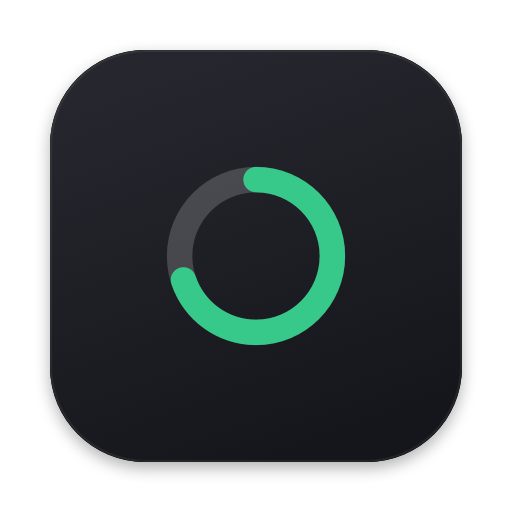
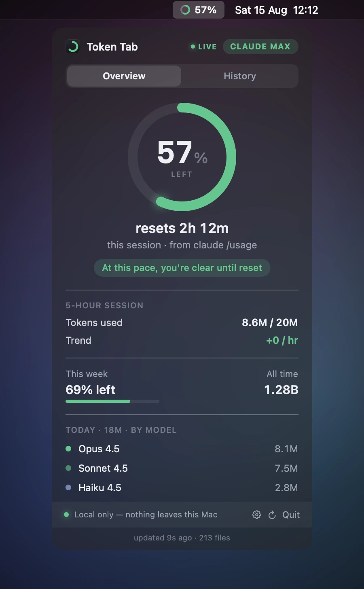
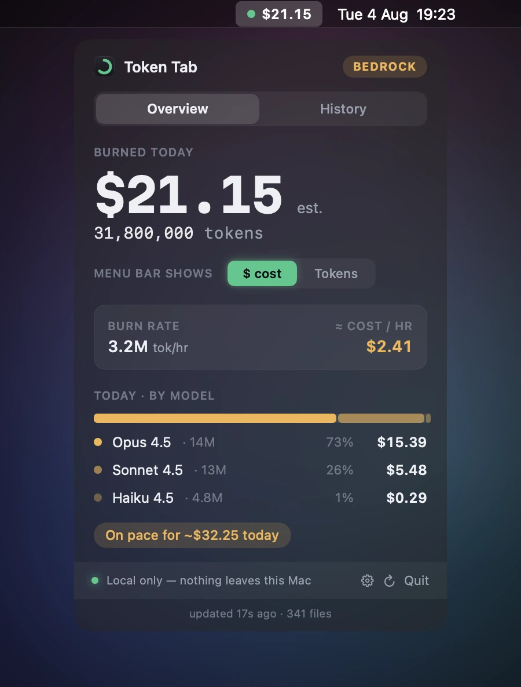
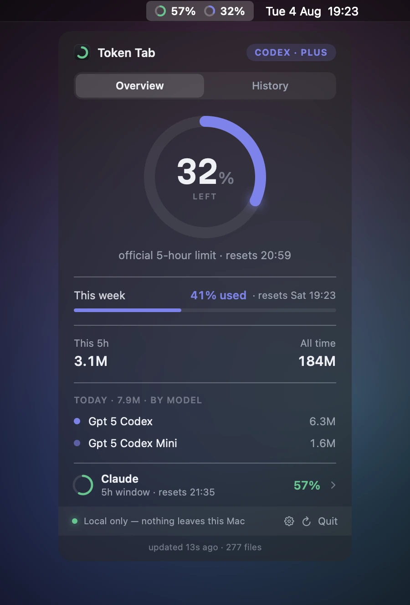
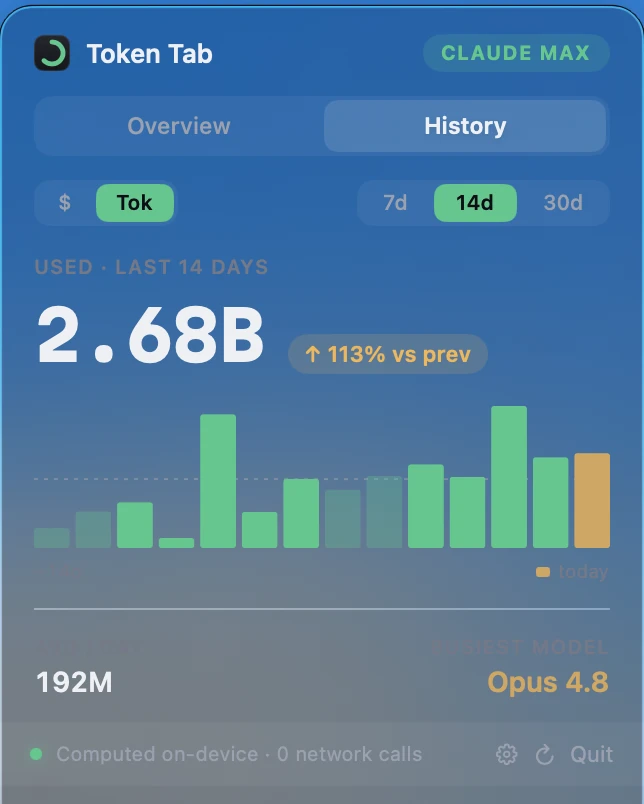

# Token Tab

<p align="center">
  <br>
  <picture>
    <source media="(prefers-color-scheme: dark)" srcset="app/Branding/gauge-wordmark-dark.png">
    
  </picture>
</p>

[](https://github.com/YiftachCohen/token-tab/actions/workflows/ci.yml)
[](LICENSE)
[](package.json)

<p align="center">
  <picture>
    <source media="(prefers-color-scheme: light)" srcset="docs/screenshots/menubar-overview-light.webp">
    
  </picture>
</p>
<p align="center">
  
  
  
</p>

Token Tab shows your Claude Code and Codex token usage in the macOS menu bar. It reads the logs
Claude Code already writes to `~/.claude` — and, if you use OpenAI's Codex CLI, the
session logs it writes to `~/.codex` — no API keys, no keychain, no network calls.
It reads token counts off disk and shows them; nothing leaves your machine.

Click the menu bar item for your current 5-hour usage window (with an exact reset
countdown) and a local cost estimate.

## What it reads

- `~/.claude/projects/**/*.jsonl` — the transcripts Claude Code already writes.
- `~/.codex/sessions/**/*.jsonl` (and `archived_sessions/`) — Codex CLI rollout logs,
  when present. Only the `token_count` usage numbers, official rate-limit percentages,
  model ids, and session ids are decoded; `response_item` content lines never are.
- Tokens per model, per surface (subscription / Bedrock / Codex), per window (today / this week / last 5h).
- A dollar **estimate** from a bundled per-model rate table — local arithmetic, not an invoice (see [Cost](#cost)).

Works the same whether Claude Code talks to the Anthropic API, a Max/Pro subscription,
or AWS Bedrock: the token counts are in the local logs either way, so no AWS
credentials are needed to read them.

## Trust model

The point of Token Tab is that it has no way to leak anything. Each claim is verifiable:

- **No network.** No network code, no dependencies.
- **No content.** The parsers decode only the metadata they need — for Claude logs:
  `type`, `model`, `message.id`, `requestId`, `usage`, `timestamp`, `isSidechain`;
  for Codex logs: `token_count` usage totals, `rate_limits`, the `turn_context` model,
  and the `session_meta` id. Neither ever touches message content (your prompts, code,
  and responses).
- **No state.** No cache, no telemetry, nothing written.

What it can't claim is to be *blind* to your data. Any usage meter has to read the
logs, and those logs contain your prompts. The narrower guarantee holds: it reads the
numbers, sends nothing, stores nothing.

### Audit it yourself

It's one dependency-free script. These greps over `src/` all print nothing:

```sh
grep -RnE "fetch|http|https|net\.|URLSession|Socket|dns" src/   # no network
grep -RnE "child_process|spawn|execFile" src/                   # no subprocess
grep -RnE "\.content" src/ | grep -v "//"                       # never reads content
cat package.json | grep -A1 dependencies                        # -> {}
```

The Claude parser is `recordFromLine` in `src/core.mjs` — it returns `message.id`,
`model`, `usage`, `timestamp`, `isSidechain`, never content. The Codex parser is
`recordsFromCodexLines` in `src/codex.mjs` — it checks each line's `type` first and
destructures only whitelisted usage/rate-limit fields; `response_item` (content) lines
are skipped by type before any payload is decoded.

In the native app, the same rule holds one level down: the ONLY subprocess anywhere in
the native stack lives in `app/Helper` (the bundled live-% helper, see
[Live server %](#live-server-)), fenced outside the audited `app/Sources` the same way
`adapters/` is fenced outside `src/` — so this still prints nothing:

```sh
grep -RnE "Process\(|posix_spawn|NSTask|popen|execv" app/Sources
```

The native app's fuller audit — sandbox entitlements, no-network greps over
`app/Sources`, the helper's own sandbox (the network-client entitlement is its one
extra power) — is in
[`app/README.md`](app/README.md#the-two-minute-audit-native-build).

## What runs where

One job — read the logs, aggregate, show usage — as two engines (a JS core and a Swift
port kept in parity) behind several front-ends. Only the live path touches the network,
and only once you turn it on:

| Piece | What it is | Network? |
|---|---|---|
| `src/` JS engine | parse + dedup + aggregate | no |
| **CLI** | `node src/token-tab.mjs` → a terminal report | no |
| **SwiftBar** | shell wrappers run the JS engine on a timer | no¹ |
| **Native app** | `app/Token Tab.app`, the menu-bar UI (App-Sandboxed, no network entitlement) | no — kernel-enforced |
| **Bundled live helper** | `Contents/MacOS/TokenTabLiveHelper`, run by launchd only when you turn on Live % | yes — via `claude` |
| **Live sidecar (script)** | `adapters/write-live.mjs` runs `claude /usage`, writes a cache file | yes — via `claude` |

¹ only the `…-live.2m.sh` variant calls `claude`; the default `…30s.sh` does not.

## Quick start

1. **Install the app.**

   ```sh
   brew tap yiftachcohen/tap
   brew install --cask token-tab
   ```

   Or grab the notarized zip or DMG from the
   [Releases page](https://github.com/YiftachCohen/token-tab/releases) — Homebrew
   installs the same signed, notarized artifact, pinned by sha256. Release builds are
   signed + notarized locally, never in CI ([`RELEASING.md`](RELEASING.md)). Or build it
   yourself in two minutes from [`app/README.md`](app/README.md) — the from-source path
   is the point of the trust model anyway.

2. **Grant read access.** On first launch it asks for a one-time, scoped, read-only
   grant on `~/.claude`. That's it — token counts, cost estimates, and the 5-hour
   window all work from there, no further setup. Codex users get a second, separate
   read-only grant on `~/.codex`, offered under **Settings ▸ Providers** (a distinct
   scope, not a widening of the first — and the same toggle turns Codex back off).

3. **On Max/Pro: click "Turn on Live %"** (in the dropdown's live row, or Settings).
   One click — no cloning the repo, no Node, no Terminal. It registers a helper
   bundled inside the app, which macOS lists under System Settings ▸ Login Items
   ("Token Tab") so it's visible and removable, and shows the real server `%` a few
   seconds later. It also learns your 5-hour token cap automatically from the first
   reading. See [Live server %](#live-server-) for what the helper is and why turning
   it on doesn't touch the app's own sandbox.

That's the whole setup. API and Bedrock (pay-per-token) users don't see this step —
there's no server quota to fetch, so the app just shows the burn panel.

## Other front-ends (power users)

The JS engine also drives a CLI and a SwiftBar plugin, for people who'd rather not run
a GUI app.

### CLI
```sh
npx @ycstudios/token-tab          # no install — or: npm i -g @ycstudios/token-tab
node src/token-tab.mjs            # from a checkout: human report
node src/token-tab.mjs --json     # machine-readable
node src/token-tab.mjs --swiftbar # SwiftBar format
```

### SwiftBar
One symlink and you have `◧ <tokens>` in the menu bar in about a minute. See
[`swiftbar/README.md`](swiftbar/README.md). SwiftBar may need Full Disk Access to read
`~/.claude` — broader than the native app's scoped grant.

Neither front-end has a bundled helper of its own — `adapters/install-live.sh` (see
below) is what feeds live `%` into the CLI or SwiftBar's `…-live.2m.sh` variant.

## Accuracy

Validated against [`ccusage`](https://github.com/ryoppippi/ccusage) on real logs:
**99.997% match** on Claude token counts. Three notes:

- **Compare like with like.** Both tools now read Claude *and* Codex logs, and `ccusage`
  folds them into one daily figure — so scope both sides the same way or the day totals
  can't line up. On Claude logs the two agree per model to within ~0.03%.
- **Codex is counted differently on purpose.** Codex logs a *cumulative* `token_count`
  per session, which resets mid-file on compaction and sometimes repeats a pair, so
  Token Tab folds per-class deltas with a per-class reset guard and suppresses the
  duplicates instead of summing the events — which is why its Codex totals run below a
  straight sum on days with duplicated pairs. The check that matters is that they track
  the official `rate_limits` percentages OpenAI writes into the same logs.
- Streaming emits several usage lines per message that share one id, with
  `output_tokens` growing across them; the parser keeps the last (final) line. It's the
  one dedup rule that moves the total, and a test pins it.

## Cost

The report and dropdown show a dollar **estimate** next to the token counts — today,
this week, all time, and per model. It's local arithmetic on a bundled rate table, on
by default (no network, no key). Scope:

- **An estimate, not your bill.** Bedrock region surcharges and cache-TTL nuances
  aren't modeled.
- **The rate table is [`src/pricing.mjs`](src/pricing.mjs)** — Anthropic's published
  USD-per-million list rates, plus OpenAI's for every Codex model with a published one
  (the `gpt-5.6` Sol/Terra/Luna tier, `gpt-5.5`, the `gpt-5.4` family, and the
  `gpt-5.x-codex` line). Ids with no published rate — a research preview, an internal
  Codex slug — land unpriced rather than guessed (below). All of it is there to audit
  and edit. Cache classes derive from the input rate by each vendor's multipliers:
  Anthropic bills cache **write** at 1.25× input (the 5-minute rate; logs don't record
  the TTL) and cache **read** at 0.10×; OpenAI doesn't bill a cache-write step at all,
  and reads at the same 0.10×. All four token classes are priced separately.
- **`[1m]` and Bedrock ids normalize to the base model** — no long-context premium on
  current models; `us.anthropic.<id>` reuses the same list rate.
- **Unknown model ⇒ tokens counted, price not invented.** It still counts toward every
  token total; it just lands in an `unpriced` line instead of getting a guessed dollar
  figure.

Claude token counts reconcile with `ccusage` (per-model within ~0.03%). The **dollar totals
differ by design** — `ccusage` prices off LiteLLM's community table, Token Tab off
Anthropic's list rates — so expect divergence on cache-heavy, Opus-tier usage. Token
Tab's rates sit in one short, editable file.

## Configuration

Set these as env vars, or in a local `KEY=VALUE` file kept out of the repo —
`~/.config/token-tab/env` (or `~/.token-tab.env`). Only `TOKENTAB_*` keys (plus
`CLAUDE_CODE_USE_BEDROCK`) are read; real env vars take precedence.

| Var | What it does |
|---|---|
| `TOKENTAB_LOG_DIR` | non-default log directory (default `~/.claude/projects`) |
| `CLAUDE_CONFIG_DIR` | reads `$CLAUDE_CONFIG_DIR/projects` |
| `TOKENTAB_PROVIDERS` | which providers to read — `all`, or a comma list of `claude`,`codex` (default: every one whose log directory exists; a missing one is silently skipped) |
| `TOKENTAB_CODEX_LOG_DIR` | non-default Codex root, holding `sessions/` and `archived_sessions/` (default `$CODEX_HOME`, else `~/.codex`) |
| `TOKENTAB_WINDOW_CAP` | your plan's 5h token cap, to show a window `%` (see below) |
| `CLAUDE_CODE_USE_BEDROCK` | Claude Code's Bedrock flag; switches the app to the pay-per-token panel² |
| `TOKENTAB_LIVE` | opt in to the live server `%` via `claude -p "/usage"` for the CLI/SwiftBar (off by default; the app uses the one-click toggle instead) |
| `TOKENTAB_LIVE_CACHE` | where a live reader writes its JSON — bundled helper or script, same file (default `<logDir>/.token-tab-live.json`) |
| `TOKENTAB_CLAUDE_BIN` | absolute path to `claude` when it isn't auto-resolved (launchd's and SwiftBar's minimal PATH often need this) |
| `TOKENTAB_LIVE_DEBUG` | prints why live data was unavailable to stderr (diagnostic only) |

² On Bedrock, Claude Code logs bare `claude-*` ids that are indistinguishable from a
subscription, so the mode can't be inferred from the logs — this flag is the signal. A
sandboxed app launched from Finder won't see your shell exports, so put it in the env
file above too.

## The 5-hour window

The headline is your token count for today. On a subscription the dropdown also shows
your current 5-hour rate-limit window, computed entirely from local logs (Anthropic
resets usage in fixed 5-hour blocks anchored to your first message of the block).

- **The reset countdown is exact** ("Resets in 3h36m"), verified against Claude's own
  `/usage`: the window starts at your first message, not the top of the hour.
- **A `%` needs a cap, and the app gets one for you.** Anthropic doesn't publish the
  per-plan cap, so Token Tab won't guess one out of thin air — but with Live % on (see
  below), it learns the cap automatically from a real reading (cap ≈ window tokens ÷
  session `%`) and keeps using it once the reading goes stale. `TOKENTAB_WINDOW_CAP` is
  the fallback for CLI/SwiftBar use or if you'd rather set it by hand: open Claude's
  `/usage`, note "N% used", and set the cap to `current-window-tokens / (N/100)`. For
  example, 20M at 5% ⇒ `TOKENTAB_WINDOW_CAP=400000000`.
- **Codex needs none of that.** OpenAI writes the real figures into the rollout logs —
  a `rate_limits` snapshot carrying the 5-hour primary and the weekly secondary
  percentage — so Token Tab quotes them (as of the last snapshot) rather than inferring
  anything. Worth keeping straight when you read the two side by side: Claude's `%` is a
  local estimate (or a live reading), Codex's is OpenAI's own number.

## Live server %

The live server `%` (what Claude's `/usage` shows) is the authoritative number Anthropic
tracks server-side — sharper than the local estimate, which only sees tokens already
logged. In the app it's one click: **Turn on Live %**, in the dropdown's live row or in
Settings. This never makes the app itself phone home — the app stays App-Sandboxed with
no network entitlement, unchanged. What the click does:

- **Registers a bundled helper** (`Contents/MacOS/TokenTabLiveHelper`, source fenced at
  [`app/Helper/main.swift`](app/Helper/main.swift)) with `SMAppService`. macOS — not the
  app — runs it, on its own timer (every 5 minutes, plus once at registration), and lists
  it under **System Settings ▸ Login Items** as "Token Tab": visible, and removable with
  one click there or in Settings. macOS may ask you to approve it first; the app
  deep-links straight to Login Items for that.
- **What the helper runs**: `claude -p "/usage" --output-format json` — the official
  `claude` CLI does the keychain read and the network call; the helper only parses its
  stdout, using the same pure parser the app uses
  ([`app/Sources/TokenTabCore/LiveParse.swift`](app/Sources/TokenTabCore/LiveParse.swift),
  parity-tested against `src/live-parse.mjs`).
- **Where it writes**: atomically to `<logDir>/.token-tab-live.json` — inside the folder
  you already granted, ignored by both log walkers (hidden and not `*.jsonl`). The app
  reads that file as plain data.
- **Fails closed.** If `claude` can't be resolved, times out, or its output format
  changes, the helper writes nothing and the app falls back to the local estimate. A
  missed five-minute refresh is marked stale after one minute of scheduling slack and
  shows when the last successful reading landed. Every run appends one line to
  `~/Library/Logs/token-tab-live.log` (self-trims at 64KB) — useful for diagnosing why a
  reading didn't land.
- **Honors the same config** as everything else: `TOKENTAB_CLAUDE_BIN`,
  `TOKENTAB_LIVE_CACHE`, `TOKENTAB_LOG_DIR`, `CLAUDE_CONFIG_DIR`, and the
  `~/.config/token-tab/env` dotfile.

With a fresh reading the app headlines `91% left · live` and learns your 5-hour cap from
it automatically (see [above](#the-5-hour-window)).

**Trust nuance, precisely stated:** the app binary is still App-Sandboxed with no
network entitlement — unchanged, kernel-enforced. The helper is a *separate* binary in
the same bundle, **also App-Sandboxed** (macOS requires it: a sandboxed app may only
register sandboxed agents), opened exactly as far as its one job needs — the network
client entitlement for the `claude /usage` call plus scoped read-write on `~/.claude`
([`app/Bundle/TokenTabLiveHelper.entitlements`](app/Bundle/TokenTabLiveHelper.entitlements)
is short; read it). It is never spawned by the app (`launchd` runs it) and only runs at
all once you flip Live % on. `app/README.md`'s audit shows this in two commands: the
app binary's signature lists the sandbox and no network; the helper's lists the sandbox
plus network-client — the one process built to make the call, and nothing else.

### From source, or for the CLI/SwiftBar: the script path

The bundled helper is new; the original script agent still exists, still works, and is
what feeds live `%` into the CLI and SwiftBar (which have no bundled helper of their
own):

```sh
adapters/install-live.sh             # LaunchAgent, refreshes every 5 min
adapters/install-live.sh uninstall   # stop + remove it
node adapters/write-live.mjs         # one-off, no scheduler
```

It runs the same `claude /usage` call via `adapters/write-live.mjs` /
`adapters/claude-live.mjs` (fenced outside `src/`, mirroring how the app's helper is
fenced outside `app/Sources`) and writes the same cache file, so the app happily reads
readings from either source. Reach for this path if you'd rather audit a ~100-line shell
script than trust a signed binary, or if you're driving usage from the CLI or SwiftBar's
`swiftbar/token-tab-live.2m.sh` (which sets `TOKENTAB_LIVE=1`; the default
`token-tab.30s.sh` never spawns anything).

If you previously installed the script agent and now use the app's one-click toggle
instead, `adapters/install-live.sh uninstall` removes it. Keeping both running is
harmless — they use distinct LaunchAgent labels (`com.tokentab.live` for the script,
`com.tokentab.liveagent` for the bundled helper) so they can't collide — but it does
mean two redundant `/usage` calls every few minutes. The Settings panel tells you when
an external script is already feeding fresh readings, so you know the bundled helper
isn't needed.

The local 5-hour window stays the default everywhere and needs no opt-in.

## Develop

```sh
npm test     # node --test, golden-fixture suite for the parser core
```

`src/core.mjs` is a pure, I/O-free parser (so tests pin every edge case without a
filesystem); `src/pricing.mjs` is the pure price table + cost math, injected into the
parser so the rates stay testable; `src/token-tab.mjs` is the thin I/O shell. The Swift
port in `app/Sources/TokenTabCore` is kept in deliberate parity — see
[`AGENTS.md`](AGENTS.md).

The screenshots above are **rendered, not screenshotted** — the real `DropdownView` hosted
offscreen over staged fixture data (`TOKENTAB_SHOTS=1 swift test --package-path app --filter
ShotsTests`). Every pixel is the shipping view, and no image here is a photograph of anyone's
actual `~/.claude`.

Contributions are welcome — [`CONTRIBUTING.md`](CONTRIBUTING.md) covers the
trust invariants and the two-engine parity rule. Found a way to defeat the
trust claims? That's a security report: see [`SECURITY.md`](SECURITY.md).

Branding assets and usage live in [`app/Branding/`](app/Branding/README.md).
License: MIT.
